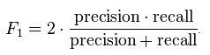

## 摘要

## 问题重述

融360是专注于金融领域的智能搜索平台，为小微企业和个人消费者提供专业的贷款、信用卡及理财在线搜索和申请服务，目前已合作近10000家金融机构，涵盖30000款金融产品，服务全国100个主要大中城市，并致力于为用户免费提供便捷、划算、可靠的金融产品和服务[1]。

本报告基于Rong360 提供的[开放数据](http://openresearch.rong360.com/) 
,涵盖了用户的各项特征描述( 访问网站记录,以及信用评估记录)和产品的属性(提供的银行,申请需要条件等).根据以上开放数据,本报告提供了以下两个方面内容的描述:

1. 下单用户属性的统计描述，以及可视化的图表展示.
2. 订单审批结果与用户数据、订单数据间的关系.


最后是附录中包含的初赛题目的代码和运算环境.模型最后的评价是基于f1值的结论,也就是召回率(recall)和精确率(precision)的调和平均.




## Part 1: 统计描述

对于原始的开放数据,首先完成数据的合并的工作,将缺失值较少的变量与`order_train`数据(包含了每笔订单的订单人ID,产品ID,等)合并起来,并进行一些特征工程.包括某产品需要房屋抵押,并且用户名下有房产,某产品需要汽车抵押,并且用户有汽车等.可以看到,在合并之后,还是会出现很多无法匹配的记录:


以下是出现缺失值变量的名称以及缺失值中通过申请的比例,值得注意的是,其中有相当多的数据缺失比例相同:是一些类似PV的数据,也就是文件`user_final.txt`文件,包含了用户访问rong360网站的数据.这部分数据缺失较多,而且在后面的预测中也发现,将该类数据移除掉反而会使得最终结果有较大提升,所以在最后的程序中将不会用到用户访问网站记录的数据.

```{r echo = F,eval = F}
load("tr4.Rdata")
names(train_final)
library(ggplot2)
library(reshape2)
train_final[train_final == -10000] = NA

names(train_final)[81] = "result"
dat1 = melt(train_final,id = "result")
ggplot(data = dat1,aes(variable,fill = is.na(value)))+
  geom_bar()+coord_flip() + 
  labs(title = "缺失值的比例情况")+
  theme(legend.title = element_text("是否缺失"))
    


dat2  = dat1[is.na(dat1$value),]
ggplot(data = dat2,aes(variable,fill = result==1))+
  geom_bar()+coord_flip() + 
  labs(title = "缺失值中申请成功的比例")+
  theme(legend.title = element_text("是否申请成功"))

```


缺失比例表:


## Part 2: 关系描述

对于各个数据关于是否申请成功的关系描述,将会从各个不同的模型来对关系进行挖掘,主要的两个思路是:

1. 描述型模型
2. 预测型模型

描述型模型旨在描述变量和最终预测结果之间的关系,所以,预测的性能不是很好,起代表作用的模型为logistic回归和决策树(CART).这两个模型能够很好的对数据进行描述,比如logistic模型描述的结果是各个变量对于最终是否成功申请的机率的影响,而决策树(CART)会给出一个简单的判断决策树,从而可以发掘业务中的决策准则.

预测型描述的含义在于可以用一个效果更好的模型来进行预测,有效的提高F1值,比如randomforest,gbm,SVM,xgboost等,这里我们主要使用的是gbm和xgboost这样的提升树的方法.由于数据量较大,randomforest无法完成简单模型的建立,而SVM需要数据是无缺失值,并且均为数值变量,所以最终选取xgboost的方式.

最后,最优的预测方法应该是使用stacking的方法,结合不同的预测结果,投票得到一个最优的结论,限于时间以及最后需要提交的源代码,所以没有使用stacking的方式.

模型的检验使用的是Hold-out方式,将原始数据分为训练集和测试集,在训练集上进行训练,用测试集验证,二者比较选择最优的参数.划分准则为前80%的数据为训练集,后20%的数据为预测集.使用这样划分的原因是由于训练集和测试集数据结构的差别,训练集的时间为754-1546,而测试集的时间为1547-1652在这个时间的变化下,模型的参数有所改变(比如通过率由训练集的17%降低到了11%左右).

### 描述型模型

#### logistic回归
描述型预测首先使用了logistic模型来进行预测:
```{r eval = F}
# load("tr4.Rdata")
model = glm(result~.-bank_id,data = train_final,family = "binomial")
summary(model)
pre = predict(model,test_final)
out = (pre>0.215)+0
writeLines(as.character(out),"submit/3.26.1.txt") # 0.2985
```

其中数据中的运算会自动将因子变量转化为Dummy Variable来完成计算,去除bank_id是因为因子变量具有较多等级(几百个),会产生过拟合的结果,整体来说logistic模型可以给出各个变量对于最终结果的关系,但计算时间较长,预测效果也一般(f1最高不超过0.30)


#### rpart决策树

决策树(Decision Tree）是在已知各种情况发生概率的基础上，通过构成决策树来求取净现值的期望值大于等于零的概率，评价项目风险，判断其可行性的决策分析方法，是直观运用概率分析的一种图解法。由于这种决策分支画成图形很像一棵树的枝干，故称决策树。在机器学习中，决策树是一个预测模型，他代表的是对象属性与对象值之间的一种映射关系。Entropy = 系统的凌乱程度，使用算法ID3, C4.5和C5.0生成树算法使用熵。这一度量是基于信息学理论中熵的概念[2]。

本文使用的CART的方法来生成决策树,基于Gini系数来进行分割.


可以看到CART的方法可以较好的展现出一些业务结构,比如`fangkuan`>90并`loan_quota_max`比80W小,并且`fangkuan_num`大于292的人有较高申请通过的可能...


### 预测型模型

预测型模型主要使用的是提升树的方法,主要使用的是xgboost, xgboost 的全称是eXtreme Gradient Boosting。正如其名，它是Gradient Boosting Machine的一个c++实现，作者为正在华盛顿大学研究机器学习的大牛 陈天奇 。他在研究中深感自己受制于现有库的计算速度和精度，因此在一年前开始着手搭建xgboost项目，并在去年夏天逐渐成型。xgboost最大的特点在于，它能够自动利用CPU的多线程进行并行，同时在算法上加以改进提高了精度。它的处女秀是Kaggle的 希格斯子信号识别 竞赛，因为出众的效率与较高的预测准确度在比赛论坛中引起了参赛选手的 广泛关注 ，在1700多支队伍的激烈竞争中占有一席之地。随着它在Kaggle社区知名度的提高，最近也有队伍借助xgboost在比赛中夺得第一。[3]

该两种算法均为黑箱模型,无法提取一些描述型的结论来对于数据之间的关系作出很好的解释.而预测效果是远比描述型模型的效果要好(会提高5%左右的f1值).


## 附录1: 问题3代码及运算环境
linux Deepin (Ubuntu) X64 0.353
```{r eval =FALSE}
library(caret)
library(dplyr)

##################################读取数据

product = read.table("data/product.final.txt",
                           header = T,sep = "\t") 

product_final = select(product,-is_p2p) %>%
                mutate(.,
                early_repayment_na = is.na(early_repayment)+0,
                penalty_na = is.na(penalty)+0,
                apply_ratio = fangkuan_num/apply_num)
product_final$apply_ratio[is.na(product_final$apply_ratio)] <- 0 

apply(product_final,2,function(x) sum(is.na(x)))
save(product_final,file = "newdata/product.Rdata")


rm(list = ls())


##########################################quality
quality = read.table("data/quality.final.txt",
                     header = T,sep = "\t")


quality =   group_by(quality,user_id) %>%
  summarise(.,
            city_id = first(city_id),
            application_type = first(application_type), 
            application_term = first(application_term), 
            application_limit = first(application_limit), 
            op_type = first(op_type),
            col_type = first(col_type), 
            user_loan_experience = first(user_loan_experience), 
            user_has_car = first(user_has_car), 
            user_income_by_card = first(user_income_by_card), 
            user_work_period = first(user_work_period), 
           col_value = first(col_value),
          house_payment_records = first(house_payment_records), 
            car_value = first(car_value),
            col_has_mortgage = first(col_has_mortgage),
            reapply_count = all(is.na(reapply_count)), 
            product_type = first(product_type), 
            apply_from = first(apply_from), 
            platform =  first(platform), 
            spam_score = first(spam_score), 
            mobile_verify = first(mobile_verify), 
            source = first(source), 
            medium = first(medium),            
            mobile_source = first(mobile_source), 
            mobile_medium = first(mobile_medium), 
            bank_id = first(bank_id),
            quality_amount = n()  
  )


quality_final = quality
save(quality_final,file = "newdata/quality.Rdata")
##load("newdata/quality.Rdata")

user = read.table("data/user.final.txt",head = T,sep ="\t")
me = first
#   function(x){
#   mean(x,na.rm=T)
# }
# name.user = names(user)
user = group_by(user,user_id) %>%
  summarise(.,pv = me(pv),
            pv_index_loan = me(pv_index_loan), 
            pv_apply_total = me(pv_apply_total), 
            pv_ask = me(pv_ask), 
            pv_calculator = me(pv_calculator), 
            order_count_loan = me(order_count_loan), 
            pv_daikuan = me(pv_daikuan), 
            pv_credit = me(pv_credit), 
            pv_search_daikuan = me(pv_search_daikuan), 
            pv_detail_daikuan = me(pv_detail_daikuan), 
            pv_date = me(date),user_amount = n())
# names(user) = c(name.user,"user_amount")
user_final = user
save(user_final,file = "newdata/user.Rdata")

rm(list = ls())
load("newdata/product.Rdata")
load("newdata/quality.Rdata")
load("newdata/user.Rdata")
train = read.table("data/order_train.txt",header = T,sep = "\t")
test = read.table("data/order_test_no_label.txt",header = T,sep = "\t")


train_final = left_join(train,user_final,by = "user_id") %>%
  left_join(.,quality_final,by = "user_id") %>%
  left_join(.,product_final,by = "product_id") 

test_final = left_join(test,user_final,by = "user_id") %>%
  left_join(.,quality_final,by = "user_id") %>%
  left_join(.,product_final,by = "product_id") 


## All completed cases
dim(train_final)
# [1] 143152     59
dim(test_final)
# [2] 36108    58


yun = rbind(train_final[,-6],test_final)

##################### 1 city_fit

city_fit  = yun %>% 
      group_by(.,city_id.x,city_id.y) %>%
      summarise(.,n = n()) %>% 
      arrange(.,desc(n)) %>%
      summarise(.,cityFit = first(as.character(city_id.y)))

yun = left_join(yun,city_fit,by = 'city_id.x') %>%
        mutate(.,city_fit = 0+(as.character(city_id.y) == cityFit),
                  city_blank = is.na(city_id.x)) %>%
        select(.,-c(city_id.y,cityFit)) %>%
        rename(.,city_id = city_id.x)
  
######################### 2 limit

yun = mutate(yun,big_limit = limit>100 & limit!=200,
                  med_limit = limit<100 & limit>50 & limit%%10!=0,
                  dig_limit = round(limit) != limit & 
               !(limit %in% c(2.5,3.5,1.5,4.5)  ))


######################### house


house_function = function(col_type,house_payment_records,
                          col_has_mortgage,col_value){
  a1 = col_type %in% c(1,2,3,4,5,6,8,10,12,14,16,100) 
  a2 = house_payment_records == 1 
  a3 = col_has_mortgage == 2 
  a4 = col_value != 0
  any(a1,a2,a3,a4,na.rm = T)
}

yun = mutate(yun,house_1 = col_type %in% c(1,2,3,4,5,6,8,10,12,14,16,100),
                house_2 = col_value != 0)


table(yun$house_1[1:143152],train_final$result)


train_final = cbind(yun[1:143152,],train$result)
test_final = yun[143153:179260,]
AddVariable = function(data = train,yun = yun){
  require(dplyr)
  prepare1 = yun %>% group_by(.,city_id) %>% 
    summarise(.,city_amount = n())
  prepare2 = yun %>% group_by(.,bank_id.y) %>% 
    summarise(.,bank_amount = n())
  
  data = left_join(data,prepare1,by = "city_id")  %>%
    left_join(.,prepare2,by = "bank_id.y")
  
  mutate(data,weekday = factor(date%%7),
         month = factor(date%%365%/%31),
         fit_user = is.na(user_amount),
         fit_quality = is.na(quality_amount),
         big_city = city_amount >1000,
         med_bank = bank_amount > 30,
         big_bank = bank_amount >100,
         house_3 = house*house_1,
         house_4 = house*house_2*house_1
  ) 
  
}


test_final = AddVariable(data = test_final,
                         yun = yun) %>% 
  select (.,-c(bank_id.y,
               product_id,user_id))


train_final = AddVariable(data = train_final,
                          yun = yun) %>% 
  select (.,-c(bank_id.y,
               product_id,user_id))

train_final[is.na(train_final)] = -10000
test_final[is.na(test_final)] = -10000

levels = table(trainx$city_id) %>%
          sort(.,decreasing = T)


train_final = cbind(train_final,j1)
test_final = cbind(test_final,j2)

dim(train_final)[1] -> n

index = round(n*0.8):n

trainx = train_final[-index,]
testx = train_final[index,]
save(train_final,test_final,trainx,testx,file = "tr4.Rdata")
rm(list = ls())

load("tr4.Rdata")
require(xgboost)
require(methods)
require(plyr)

apply(trainx,2,function(x) sum(x ==-10000))

load("newdata//user.Rdata")
name = names(user_final)
names(trainx) %in% name
trainx = trainx[,!names(trainx) %in% name]
testx = testx[,!names(testx) %in% name]
train_final = train_final[,!names(train_final) %in% name]
test_final = test_final[,!names(test_final) %in% name]


fc = function(pre=res,labels = train$result){
  tp = sum(pre == 1 & labels == 1)/sum(pre == 1)
  fp = sum(pre == 1 & labels == 1)/sum(labels == 1) 
  2*tp*fp/(tp+fp)
}


change = function(x){
  as.numeric(x)
}


label <- as.numeric(as.character(trainx[,69]))

data <- as.matrix(colwise(change)(trainx[,-69]))

data2 <- as.matrix(colwise(change)(testx[,-69]))
label2 = as.numeric(as.character(testx[,69]))
# weight <- as.numeric(dtrain[[32]]) * testsize / length(label)

xgmat <- xgb.DMatrix(data, label = label, missing = -10000)
param <- list("objective" = "binary:logistic",
              "bst:eta" = 0.05,
              "bst:max_depth" = 5,
              "eval_metric" = "logloss",
              "gamma" = 1,
              "silent" = 1,
              "nthread" = 16 ,
              "min_child_weight" =1.45
)
watchlist <- list("train" = xgmat)
nround =300
print ("loading data end, start to boost trees")


label3 <- as.numeric(as.character(train_final[,69]))
data3 <- as.matrix(colwise(as.numeric)(train_final[,-69]))


data4 <- as.matrix(colwise(as.numeric)(test_final))

xgmat <- xgb.DMatrix(data3, label = label3, missing = -10000)

bst2 = xgb.train(param, xgmat, nround, watchlist);
# bst.cv = xgb.cv(param, xgmat, nround,nfold = 10,watchlist)
pre3 = predict(bst2,data3)

ans1 = rep(0,999)
for (i in 1:999){
  j = 0.001*i 
  res = pre3>j
  ans1[i] = fc(pre=res,labels = label3)
}
summary(ans1)

which.max(ans1)

pre.final = predict(bst2,data4)
out  = pre.final>0.23
writeLines(as.character(out),"submit/4.14.1.txt") # 0.3417
```


## 附录2: 参考资料
[1] rong360.com
[2] http://baike.baidu.com/link?url=MkyRLzJyfyGzVwQXhyvZURRe625idG_-YaqXjCQudyKgE7mpiIklwxs-pgvUh_ps3m3Fveovoqjg6PjVEeL5bK
[3]  http://cos.name/2015/03/xgboost/


